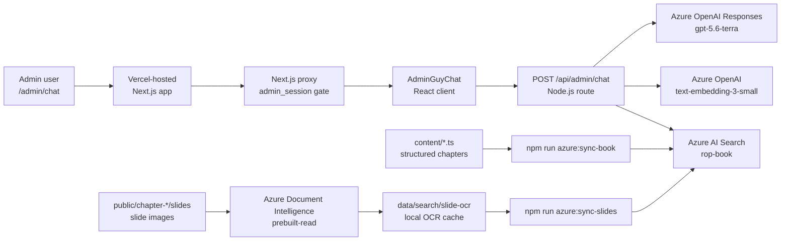

# R.O.P. Azure RAG Technical Infrastructure

Status: implemented baseline, documented on 2026-07-15  
Audience: AI architect / certified Azure Cloud Architect  
Repository: `nboitout/ROP`  
Primary production surface: `https://www.guy-boitout.com/admin/chat`

This document describes the technical infrastructure currently implemented for the R.O.P. book search, Azure RAG layer, slide OCR ingestion, and the admin chatbot "Assistant de Guy". Secret values are intentionally excluded.

## 1. Executive Summary

The project is a Next.js application deployed through Vercel and backed by an Azure RAG stack. The admin section is password protected and exposes two AI/search capabilities:

- A legacy server-side book text search at `/admin/search`.
- A newer RAG chatbot at `/admin/chat`, backed by Azure AI Search and Azure OpenAI.

The RAG corpus currently combines:

- Structured chapter text extracted directly from the TypeScript content model.
- OCR text extracted from slide deck images using Azure AI Document Intelligence.
- Deep links back into the protected or public chapter reader UI.
- Slide image thumbnails for slide citations.

Runtime retrieval is hybrid:

- Keyword search through Azure AI Search `search`.
- Vector retrieval through Azure AI Search `vectorQueries` over `contentVector`.
- Query embeddings generated with Azure OpenAI `text-embedding-3-small`.

Answer generation uses Azure OpenAI Responses API with the chat deployment `gpt-5.6-terra`. The chatbot prompt allows internal model knowledge only for established anatomy and physiology background. Any R.O.P. reasoning, treatment, practice advice, or symptom interpretation must be grounded in retrieved book/slide citations.

## 2. Resource Inventory

| Layer | Resource | Current name / setting | Notes |
| --- | --- | --- | --- |
| Azure resource group | Resource group | `3e_livre` | Logical container for the RAG project resources. |
| Azure AI Search | Search service | `srch-3e-livre-0714113648` | Hosts the vector/hybrid search index. |
| Azure AI Search | Index | `rop-book` | Unified index for text passages and OCR slide passages. |
| Azure OpenAI | OpenAI resource | `aoai-3e-livre-0714113648` | Endpoint used for embeddings and Responses API. |
| Azure OpenAI | Embedding deployment | `text-embedding-3-small` | Produces 1536-dimensional vectors. |
| Azure OpenAI | Chat deployment | `gpt-5.6-terra` | Used by RAG answer mode and chatbot mode. |
| Azure AI Document Intelligence | Document Intelligence resource | `di-3e-livre-0714113648-a4010` | Uses `prebuilt-read` for slide OCR. |
| Vercel | Project | `nboitouts-projects/rop` | Git-linked project; `main` is pushed directly. |
| GitHub | Repository | `nboitout/ROP` | Source of the Next.js app and ingestion scripts. |

Current non-secret runtime endpoints and deployments from local configuration:

| Setting | Value |
| --- | --- |
| `AZURE_SEARCH_ENDPOINT` | `https://srch-3e-livre-0714113648.search.windows.net` |
| `AZURE_SEARCH_INDEX` | `rop-book` |
| `AZURE_OPENAI_ENDPOINT` | `https://aoai-3e-livre-0714113648.openai.azure.com` |
| `AZURE_OPENAI_EMBEDDING_DEPLOYMENT` | `text-embedding-3-small` |
| `AZURE_OPENAI_CHAT_DEPLOYMENT` | `gpt-5.6-terra` |
| `AZURE_DOCUMENT_INTELLIGENCE_ENDPOINT` | `https://di-3e-livre-0714113648-a4010.cognitiveservices.azure.com/` |

## 3. Logical Architecture



## 4. Application Runtime

The app is a Next.js 16 / React 19 application. The RAG runtime is implemented inside the Next.js app rather than a separate FastAPI service.

Important runtime files:

| File | Responsibility |
| --- | --- |
| `app/admin/layout.tsx` | Admin navigation. Links `/admin/chat` from the top banner. |
| `app/admin/chat/page.tsx` | Dedicated admin chatbot page. |
| `components/admin/AdminGuyChat.tsx` | Client-side chat UI, citation panel, message state, Enter-to-send behavior. |
| `app/api/admin/chat/route.ts` | Admin-only chatbot API route. |
| `lib/azureGuyChat.ts` | Chat-specific retrieval query construction, prompt policy, Azure OpenAI Responses call. |
| `lib/azureRag.ts` | Shared Azure RAG primitives: env config, embeddings, Azure Search upload/query, single-shot RAG answer. |
| `app/api/admin/search/rag/route.ts` | Admin-only single-shot RAG answer route used by legacy `/admin/search`. |
| `components/admin/AdminRagPanel.tsx` | Legacy separate RAG answer panel on `/admin/search`. |
| `lib/searchIndex.ts` | Local structured text index for classic search and text ingestion. |
| `content/slidesyncRegistry.ts` | Slide record registry used for OCR and slide ingestion. |

The API routes are explicitly configured as:

- `runtime = 'nodejs'`
- `dynamic = 'force-dynamic'`

This is appropriate because the routes call Azure services at request time and rely on server-side environment variables.

## 5. Admin Authentication and Access Control

The admin area is protected by a password flow:

- `POST /api/admin/auth` compares the submitted password against `ADMIN_PASSWORD`.
- On success it sets `admin_session=authenticated`.
- The cookie is `httpOnly`, `sameSite=lax`, path-scoped to `/`, one-day max age, and `secure` in production.
- `proxy.ts` redirects all `/admin/*` requests except `/admin/login` to `/admin/login` unless the cookie is present.

Relevant files:

- `app/api/admin/auth/route.ts`
- `proxy.ts`
- `lib/access.ts`

RAG/chat API routes perform their own cookie check before processing. This means Azure Search query keys and Azure OpenAI keys remain server-side only.

Important access-model caveat:

- Search index documents include an `access` field (`free` or `paid`).
- Current admin RAG endpoints do not filter by `access` because the feature is admin-only.
- If a public chatbot is introduced, `access` must become an authorization filter in Azure Search queries, not merely display metadata.

## 6. Corpus and Data Model

### 6.1 Structured Book Text

Structured chapters live in `content/*.ts` and are registered through `content/registry.ts`. The text search index is built in-memory by `getBookTextSearchIndex()`.

Supported languages:

- `fr`
- `en`
- `de`
- `es`
- `it`
- `th` is included in filters but currently has no indexed records.

Supported text block types:

- `section`
- `para`
- `lead`
- `sub`
- `bullets`
- `numbered`
- `leadBullets`
- `table`
- `xref`
- `rop`
- `figure` and `reflexAtlas` exist in the content model but do not currently emit searchable text unless they contain text through another block representation.

Each text record contains:

- Language and chapter metadata.
- Section metadata.
- Block index and block type.
- Plain text content.
- A deep link back to the reader, such as `/lecture/chapitre-5?lang=fr#p-section-id-3`.
- An access flag (`free` or `paid`).

Current generated text corpus:

| Scope | Records | Chapter/language versions |
| --- | ---: | ---: |
| French | 2,693 | 22 |
| English | 1,034 | 11 |
| German | 1,037 | 11 |
| Spanish | 1,036 | 11 |
| Italian | 1,037 | 11 |
| Thai | 0 | 0 |
| All | 6,837 | 66 |

### 6.2 Slide OCR Corpus

Slides are registered in `content/slidesyncRegistry.ts`. A slide record maps:

- A chapter and language.
- A slide number.
- A slide image path in `public/chapter-*/slides`.
- A title.
- A chapter-reader deep link.
- The closest section/block anchor from the slide synchronization metadata.

The registry deduplicates repeated images by `chapterKey` and source path.

Current generated slide corpus:

| Scope | Slide records |
| --- | ---: |
| French | 496 |
| English | 72 |
| German | 55 |
| Spanish | 53 |
| Italian | 53 |
| Thai | 0 |
| All | 729 |

### 6.3 OCR Cache Storage

OCR results are stored locally under:

```text
data/search/slide-ocr/<base64url(record.id)>.json
```

Each cache entry contains:

| Field | Purpose |
| --- | --- |
| `id` | Stable slide record id, for example `chapter-5:fr:slide:1`. |
| `chapterKey` | Chapter key. |
| `lang` | OCR language. |
| `slideNumber` | 1-based slide number. |
| `title` | Slide title from registry. |
| `imageSrc` | Public image URL used by the app. |
| `href` | Deep link to the chapter reader. |
| `sourcePath` | Local slide image path. |
| `contentHash` | SHA-256 of the image file. Used for stale-cache detection. |
| `ocrText` | OCR text extracted by Azure Document Intelligence. |
| `ocrEngine` | Currently `azure-document-intelligence:prebuilt-read`. |
| `apiVersion` | Document Intelligence API version used. |
| `updatedAt` | ISO timestamp. |

Git policy:

- `data/search/slide-ocr/.gitkeep` is tracked.
- `data/search/slide-ocr/*.json` is ignored by `.gitignore`.
- OCR cache JSON is therefore a local/generated batch artifact, not a committed source artifact.

Operational implication:

- Azure AI Search is the deployed retrieval store.
- Rebuilding slide embeddings on another machine requires regenerating or transferring OCR cache JSON first.
- A future production-grade version should store OCR artifacts in Azure Blob Storage or another durable artifact store, with metadata keyed by slide id and image hash.

## 7. Azure AI Search Index

Index name: `rop-book`

The index currently stores both text and slide records in one schema. The field list was verified through Azure AI Search:

| Field | Type / role in application |
| --- | --- |
| `id` | Encoded document key. Text ids are `base64url("text:<record.id>")`; slide ids are `base64url("slide:<record.id>")`. |
| `kind` | Discriminator: `text` or `slide`. Used in filters and UI labels. |
| `lang` | Language filter. |
| `chapterKey` | Stable chapter key, for example `chapter-5`. |
| `chapterNumber` | Numeric chapter order where applicable. |
| `chapterTitle` | Display and retrieval context. |
| `sectionId` | Stable section id. |
| `sectionTitle` | Display and retrieval context. |
| `blockIndex` | Text block index or slide anchor block index. |
| `blockType` | Text block type or `slide`. |
| `slideNumber` | Present for slide records. |
| `title` | Source title shown in citations. |
| `content` | Searchable text body: structured book text or OCR slide text plus slide title. |
| `href` | Deep link back into the chapter reader. |
| `imageSrc` | Present for slide records; used for citation thumbnails. |
| `sourcePath` | Source file path for traceability. |
| `access` | `free` or `paid`; currently informational in admin mode. |
| `contentVector` | 1536-dimensional vector produced by `text-embedding-3-small`. |

The application assumes:

- `contentVector` is queryable by vector search.
- `content` supports keyword search.
- `kind` and `lang` are filterable.
- Display fields are retrievable.

The index definition itself is currently not stored as Infrastructure as Code in the repository. For repeatability, the next infrastructure step should be to codify the index schema in Bicep, Terraform, Pulumi, or an Azure CLI script checked into the repo.

## 8. Ingestion Pipelines

All ingestion jobs run from Node/TypeScript scripts through `tsx`. They load `.env.local` using `@next/env`.

### 8.1 Text Ingestion

Script:

```bash
npm run azure:sync-book
```

Dry run:

```bash
npm run azure:sync-book:dry
```

Relevant source:

- `scripts/sync-azure-search-index.ts`
- `lib/searchIndex.ts`
- `lib/azureRag.ts`

Pipeline:

1. Build text records with `getBookTextSearchIndex()`.
2. Optionally filter by `--lang=<all|fr|en|de|es|it|th>`.
3. Optionally limit with `--limit=<number>`.
4. Optionally exclude section-heading-only records with `--exclude-sections`.
5. Create embedding input:

   ```text
   Chapter: <chapterTitle>
   Section: <sectionTitle>
   Language: <lang>

   <record.text>
   ```

6. Embed records in batches of 48 by default.
7. Validate embedding dimension is 1536.
8. Upload to Azure AI Search with `@search.action = "upload"`.

CLI options:

| Option | Purpose |
| --- | --- |
| `--lang=<...>` | Restrict by language. |
| `--limit=<number>` | Sync first N records after filters. |
| `--dry-run` | Print plan without Azure calls. |
| `--embedding-batch-size=<number>` | Defaults to 48; script rejects values above 100. |
| `--exclude-sections` | Skip section-heading-only records. |

### 8.2 Slide OCR

Script:

```bash
npm run azure:ocr-slides
```

Dry run:

```bash
npm run azure:ocr-slides:dry
```

Relevant source:

- `scripts/ocr-slides.ts`
- `scripts/slide-ocr-cache.ts`
- `lib/azureDocumentIntelligence.ts`
- `content/slidesyncRegistry.ts`

Pipeline:

1. Build slide records with `getBookSlideSearchIndex()`.
2. Optionally filter by language and chapter.
3. Resolve each slide image under `public/...`.
4. Compute SHA-256 hash of the image.
5. Skip OCR if the cache entry exists and `contentHash` matches.
6. Submit the image to Azure Document Intelligence `prebuilt-read`.
7. Poll `operation-location` until success or timeout.
8. Compact OCR text and write the local cache JSON.

CLI options:

| Option | Purpose |
| --- | --- |
| `--lang=<...>` | Restrict by language. |
| `--chapter=<chapter-key>` | Restrict to one chapter, for example `chapter-5`. |
| `--limit=<number>` | OCR first N slide records after filters. |
| `--dry-run` | Print plan without Azure calls. |
| `--force` | Re-run OCR even when cache hash matches. |
| `--high-resolution` | Adds Azure `ocrHighResolution` feature for dense/small text. |

Document Intelligence configuration:

- Default API version: `2024-11-30`.
- Model: `prebuilt-read`.
- Locale is set for `fr`, `en`, `de`, `es`, and `it`; omitted for unsupported language codes.
- Default timeout: 120 seconds per image.
- Default poll interval: `retry-after` header if present, otherwise 1500 ms.

### 8.3 Slide Vector Sync

Script:

```bash
npm run azure:sync-slides
```

Dry run:

```bash
npm run azure:sync-slides:dry
```

Relevant source:

- `scripts/sync-azure-slide-index.ts`
- `scripts/slide-ocr-cache.ts`
- `content/slidesyncRegistry.ts`

Pipeline:

1. Build slide records from the registry.
2. Read OCR cache for each slide record.
3. Validate cache is current by comparing `contentHash` against the image SHA-256.
4. Skip missing/stale cache entries unless `--strict-cache` is provided.
5. Create embedding input:

   ```text
   Source type: slide
   Chapter: <chapterTitle>
   Section: <sectionTitle>
   Slide: <slideNumber>
   Language: <lang>

   <slide.title>

   <ocrText>
   ```

6. Embed in batches of 48 by default.
7. Validate 1536 dimensions.
8. Upload `kind = "slide"` documents to the same `rop-book` index.

CLI options:

| Option | Purpose |
| --- | --- |
| `--lang=<...>` | Restrict by language. |
| `--chapter=<chapter-key>` | Restrict to one chapter. |
| `--limit=<number>` | Sync first N prepared records after filters. |
| `--dry-run` | Print plan without Azure calls. |
| `--strict-cache` | Fail on missing/stale/empty OCR cache instead of skipping. |
| `--embedding-batch-size=<number>` | Defaults to 48; script rejects values above 100. |

### 8.4 Current Sync Behavior

Both sync scripts use Azure Search `upload`, which creates or replaces documents with matching ids.

They do not currently:

- Delete stale documents when source records are removed.
- Recreate the index schema.
- Validate remote index field attributes before upload.
- Persist OCR cache outside the local filesystem.

For production operations, add a reconciliation job or explicit delete action for removed records.

## 9. Retrieval and RAG Runtime

### 9.1 Shared Retrieval Function

`searchAzureBook()` in `lib/azureRag.ts` is the shared retrieval primitive.

Inputs:

- `query`
- `lang`, default `all` in the function but API routes generally default to `fr`
- `top`, default 12

Process:

1. Trim query; return empty result for empty query.
2. Generate one query embedding through Azure OpenAI.
3. Call Azure AI Search `/docs/search`.
4. Send both:
   - `search: <query>` for keyword retrieval.
   - `vectorQueries` against `contentVector`.
5. Apply filter:

   ```text
   (kind eq 'text' or kind eq 'slide')
   ```

   If language is not `all`, add:

   ```text
   and lang eq '<lang>'
   ```

6. Set vector `k` to `max(top * 4, 40)`.
7. Select retrievable display/context fields only.
8. Truncate citation snippets to 320 characters for UI display.

This is hybrid keyword + vector retrieval. There is no explicit semantic reranker layer in the current implementation.

### 9.2 Single-Shot RAG Answer

Used by:

- `POST /api/admin/search/rag`
- `components/admin/AdminRagPanel.tsx`

Implementation:

- `answerAzureBookQuestion()` in `lib/azureRag.ts`
- Top-K: 8
- `max_output_tokens`: 900

Prompt policy:

- Answer only from retrieved context.
- Retrieved context may include chapter text and OCR slide text.
- Cite sources as `[1]`, `[2]`, etc.
- If context is insufficient, say so and list closest passages.
- Keep answer concise and practical.

### 9.3 Chatbot RAG

Used by:

- `/admin/chat`
- `POST /api/admin/chat`
- `components/admin/AdminGuyChat.tsx`

Implementation:

- `answerGuyChat()` in `lib/azureGuyChat.ts`

Request validation:

- Admin cookie required.
- `messages` must contain 1 to 14 user/assistant messages.
- Each message must be 1 to 6000 characters.
- Roles limited to `user` and `assistant`.
- Language limited to `all`, `fr`, `en`, `de`, `es`, `it`, `th`.
- Route defaults to `fr`.

Retrieval query construction:

- Uses the last 8 conversation messages.
- User messages are truncated to 650 characters for retrieval query.
- Assistant messages are truncated to 360 characters for retrieval query.
- Retrieval Top-K: 10.

Generation context:

- Uses the last 8 conversation messages.
- User messages are truncated to 900 characters.
- Assistant messages are truncated to 520 characters.
- Each retrieved source content block is truncated to 1150 characters.
- `max_output_tokens`: 1000.

Prompt policy:

- The chatbot discusses only topics connected to the indexed R.O.P. book corpus.
- For established anatomy and physiology facts, it may use concise internal biomedical knowledge as background.
- For R.O.P. analysis, therapeutic reasoning, treatment suggestions, practice advice, or symptom interpretation, it must use only retrieved book/slide context.
- Every R.O.P. analysis, therapy, treatment, or advice claim must cite retrieved sources.
- If context is insufficient, it must say that the retrieved corpus does not provide enough support.
- For urgent or red-flag symptoms, it must redirect to qualified medical care before discussing book context.
- Unrelated questions outside book topics should not be answered.

## 10. UI and Citation Design

The current primary interface is `/admin/chat`.

Layout:

- Left panel: retrieved RAG citations for the selected answer.
- Right panel: chat thread and composer.
- Citation panel updates when a new answer is produced.
- If several questions are asked, a switcher lets the admin select citations by answer.

Citation behavior:

- Inline citations in the generated answer are rendered as links.
- Citation cards deep-link to chapter text or slide anchors.
- Slide citations show image thumbnails via `imageSrc`.
- Text citations show source title, section, snippet, language, access, and source type.

Chat behavior:

- `Enter` sends.
- `Shift+Enter` inserts a newline.
- Send button and Enter call the same submit function.

## 11. Environment Variables

Required for Azure RAG runtime:

| Variable | Sensitive | Required by | Purpose |
| --- | --- | --- | --- |
| `AZURE_SEARCH_ENDPOINT` | No | runtime + sync | Azure AI Search service endpoint. |
| `AZURE_SEARCH_INDEX` | No | runtime + sync | Search index name, currently `rop-book`. |
| `AZURE_SEARCH_QUERY_KEY` | Yes | runtime | Query-only key for retrieval. |
| `AZURE_SEARCH_ADMIN_KEY` | Yes | sync scripts | Admin key for document upload. |
| `AZURE_OPENAI_ENDPOINT` | No | runtime + sync | Azure OpenAI resource endpoint. |
| `AZURE_OPENAI_API_KEY` | Yes | runtime + sync | Azure OpenAI API key. |
| `AZURE_OPENAI_EMBEDDING_DEPLOYMENT` | No | runtime + sync | Embedding deployment name. |
| `AZURE_OPENAI_CHAT_DEPLOYMENT` | No | RAG answer + chatbot | Chat/Responses deployment name. |
| `AZURE_DOCUMENT_INTELLIGENCE_ENDPOINT` | No | OCR script | Azure Document Intelligence endpoint. |
| `AZURE_DOCUMENT_INTELLIGENCE_KEY` | Yes | OCR script | Document Intelligence API key. |
| `ADMIN_PASSWORD` | Yes | admin login | Password for admin session creation. |

Optional version override variables:

| Variable | Default in code |
| --- | --- |
| `AZURE_SEARCH_API_VERSION` | `2026-04-01` |
| `AZURE_OPENAI_EMBEDDINGS_API_VERSION` | `2023-05-15` |
| `AZURE_DOCUMENT_INTELLIGENCE_API_VERSION` | `2024-11-30` |

Important:

- Do not store full endpoint URLs that include path/query fragments. Store only the service endpoint, for example `https://aoai-...openai.azure.com`.
- Do not include angle brackets around key values when adding Vercel env vars.
- Vercel Development env vars are not marked sensitive by the CLI in the same way as Production/Preview; treat local `.env.local` as secret material anyway.

## 12. Operational Runbooks

### 12.1 Pull Production Env Vars Locally

```powershell
vercel env pull .env.local --environment=production --yes
```

Review only variable names, not values, before running jobs.

### 12.2 OCR All Slides

```powershell
npm run azure:ocr-slides -- --lang=all
```

Use a restricted dry run first:

```powershell
npm run azure:ocr-slides:dry -- --chapter=chapter-5 --lang=fr --limit=5
```

Force OCR when slide images changed but stale cache detection is not sufficient:

```powershell
npm run azure:ocr-slides -- --chapter=chapter-5 --lang=fr --force
```

Use high-resolution OCR for dense/small slide text:

```powershell
npm run azure:ocr-slides -- --chapter=chapter-5 --lang=fr --high-resolution
```

### 12.3 Sync Book Text to Azure AI Search

```powershell
npm run azure:sync-book
```

Dry run:

```powershell
npm run azure:sync-book:dry
```

Restricted test:

```powershell
npm run azure:sync-book -- --lang=fr --limit=10
```

### 12.4 Sync OCR Slides to Azure AI Search

```powershell
npm run azure:sync-slides
```

Strict cache mode:

```powershell
npm run azure:sync-slides -- --strict-cache
```

Restricted test:

```powershell
npm run azure:sync-slides -- --chapter=chapter-5 --lang=fr --limit=10
```

### 12.5 Build Verification

```powershell
npm run lint
npx tsc --noEmit
npm run build
```

Expected current caveat:

- Lint may report pre-existing warnings in unrelated files, but should not report errors.

### 12.6 Runtime Smoke Tests

Unauthenticated admin chat route should reject:

```powershell
curl.exe -i -X POST https://www.guy-boitout.com/api/admin/chat `
  -H "Content-Type: application/json" `
  -d "{\"messages\":[{\"role\":\"user\",\"content\":\"test\"}],\"lang\":\"fr\"}"
```

Authenticated browser test:

1. Open `/admin/login`.
2. Sign in with `ADMIN_PASSWORD`.
3. Open `/admin/chat`.
4. Ask a question in French.
5. Verify:
   - A short answer is returned.
   - Citations appear in the left panel.
   - Book citations open chapter anchors.
   - Slide citations display thumbnails and open chapter anchors.

## 13. Deployment Model

Current deployment model:

- Source code is committed directly to `main`.
- `main` is pushed to GitHub.
- The Vercel project `rop` is linked by Git.
- Vercel stores production/preview/development environment variables.

The app currently keeps Azure access in server-side routes and scripts. No Azure keys are exposed to browser code.

Because the ingestion jobs are manual CLI scripts, production deployment and corpus refresh are separate operations:

- Deploying the app does not automatically OCR slides.
- Deploying the app does not automatically update Azure AI Search.
- Updating `content/*.ts` or slide images should be followed by the relevant sync command.

## 14. Failure Modes and Diagnostics

| Symptom | Likely cause | Diagnostic |
| --- | --- | --- |
| `/api/admin/chat` returns 401 | Missing admin session cookie | Sign in via `/admin/login`. |
| API returns 503 with missing env var message | Required Vercel env var missing | Check Vercel env vars for target environment. |
| RAG returns no citations | Query has no close matches or index not populated | Test `npm run azure:sync-book:dry`, inspect Azure Search document count. |
| Slide citations absent | Slide OCR/sync not run or cache stale | Run `npm run azure:ocr-slides:dry`, then `npm run azure:sync-slides -- --strict-cache`. |
| OCR script fails with 401/403 | Incorrect Document Intelligence key/endpoint | Check `AZURE_DOCUMENT_INTELLIGENCE_*`, ensure no angle brackets around key. |
| Embedding sync fails dimension check | Deployment changed or wrong model | Confirm `AZURE_OPENAI_EMBEDDING_DEPLOYMENT` points to `text-embedding-3-small`. |
| Azure Search upload fails | Index schema mismatch or admin key issue | Confirm index fields and admin key; inspect rejected document sample. |
| Chat answer lacks citations for R.O.P. advice | Prompt/model non-compliance or poor retrieval | Check retrieved citations; consider stricter post-processing or answer validation. |

## 15. Security and Governance Notes

Current protections:

- Admin UI protected by password and HTTP-only cookie.
- API routes enforce admin cookie before calling Azure.
- Query key is used for runtime search.
- Admin key is required only for upload scripts.
- Azure keys are configured as environment variables, not client-side values.
- OCR cache JSON is ignored by Git.

Gaps to address before broader/public exposure:

- Move Azure secrets to Azure Key Vault or Vercel managed secret governance with rotation process.
- Consider Microsoft Entra ID / managed identity for Azure services where supported by hosting model.
- Add IaC for resource creation and index schema.
- Add private networking / firewall rules if the app moves from public SaaS hosting to an Azure-hosted backend.
- Add application-level rate limiting on `/api/admin/chat` and `/api/admin/search/rag`.
- Add structured audit logs for admin chat usage.
- Add a medical safety evaluation suite before public or patient-facing exposure.
- Add answer post-validation to ensure R.O.P. advice claims cite retrieved corpus sources.
- Add content-access filtering if any RAG endpoint becomes public.

## 16. Known Technical Debt / Architecture Roadmap

### 16.1 Infrastructure as Code

The Azure resources and the `rop-book` index were created manually through Azure Cloud Shell / CLI. This should be converted to IaC.

Recommended artifacts:

- Resource group declaration.
- Azure AI Search service.
- Azure OpenAI resource and deployments.
- Azure AI Document Intelligence resource.
- Search index schema including vector search configuration.
- Role assignments or key retrieval conventions.
- Optional storage account for OCR artifacts.

### 16.2 OCR Artifact Store

Current OCR cache is local and ignored by Git. Recommended next state:

- Azure Blob Storage container, for example `rag-artifacts/slide-ocr`.
- Key path: `slide-ocr/<chapterKey>/<lang>/<slideNumber>.json`.
- Include `contentHash`, `ocrText`, `ocrEngine`, `apiVersion`, and `updatedAt`.
- Sync scripts read from Blob first, local cache second.
- Add lifecycle/versioning policy if OCR text is considered an auditable derived artifact.

### 16.3 Index Lifecycle

Current upload jobs are append/replace only. Recommended next state:

- Generate a manifest of expected document ids.
- Query or maintain current remote ids.
- Delete remote ids no longer present in the manifest.
- Store last sync summary with counts by kind/language/chapter.
- Optionally use index aliases for blue/green index rebuilds.

### 16.4 Retrieval Quality

Current retrieval is hybrid keyword + vector, no semantic ranker.

Potential improvements:

- Add semantic ranker if available for the service tier and language coverage.
- Add chapter-balanced retrieval to prevent one chapter from dominating broad queries.
- Add source-type balancing between `text` and `slide`.
- Add minimum-score / confidence heuristics.
- Add query rewriting for follow-up questions in multi-turn chat.
- Evaluate citations against a curated test question set.

### 16.5 Backend Shape

The current Next.js API route backend is sufficient for the present admin-only RAG workload. A separate FastAPI backend is not necessary yet.

Consider a dedicated backend if:

- The chatbot becomes public and needs independent scaling/rate limiting.
- OCR and indexing become asynchronous jobs with queues.
- Azure managed identity and private networking become mandatory.
- Observability, tracing, or evaluations require a separate service boundary.
- Long-running ingestion moves from operator CLI to scheduled jobs.

## 17. Source Reference Map

| Concern | Primary files |
| --- | --- |
| Admin auth and cookie gate | `app/api/admin/auth/route.ts`, `proxy.ts`, `lib/access.ts` |
| Admin chatbot page | `app/admin/chat/page.tsx`, `components/admin/AdminGuyChat.tsx` |
| Chat RAG backend | `app/api/admin/chat/route.ts`, `lib/azureGuyChat.ts` |
| Single-shot RAG backend | `app/api/admin/search/rag/route.ts`, `lib/azureRag.ts` |
| Legacy text search | `app/admin/search/page.tsx`, `lib/searchIndex.ts` |
| Text ingestion | `scripts/sync-azure-search-index.ts` |
| Slide OCR | `scripts/ocr-slides.ts`, `lib/azureDocumentIntelligence.ts`, `scripts/slide-ocr-cache.ts` |
| Slide ingestion | `scripts/sync-azure-slide-index.ts`, `content/slidesyncRegistry.ts` |
| Azure shared helpers | `lib/azureRag.ts` |
| Admin styling | `app/admin/admin.css` |

## 18. Minimal Rebuild Checklist

For a new Azure environment, the required sequence is:

1. Create resource group.
2. Create Azure AI Search service.
3. Create Azure OpenAI resource.
4. Deploy `text-embedding-3-small`.
5. Deploy chat model used as `AZURE_OPENAI_CHAT_DEPLOYMENT`.
6. Create Azure AI Document Intelligence resource.
7. Create `rop-book` Azure AI Search index with text, metadata, and 1536-dimensional `contentVector`.
8. Configure Vercel env vars for Production and Preview.
9. Pull env vars locally into `.env.local`.
10. Run text dry run.
11. Run text sync.
12. Run slide OCR.
13. Run slide sync with `--strict-cache`.
14. Deploy/push app.
15. Validate `/admin/chat` with citations.

The most important reproducibility gap is step 7: the index schema is not yet represented as committed IaC.
